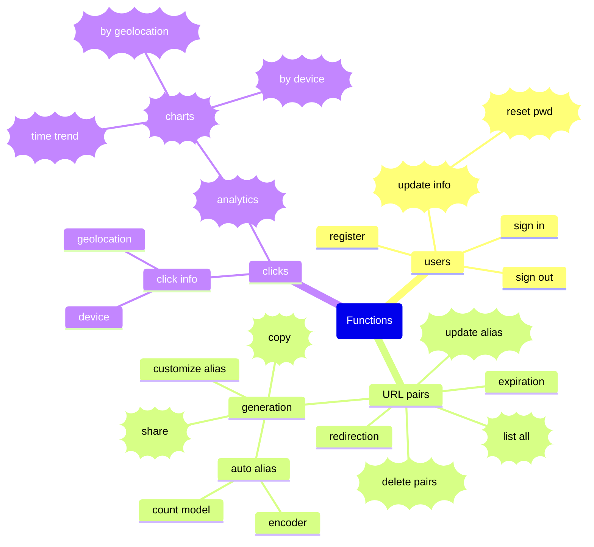
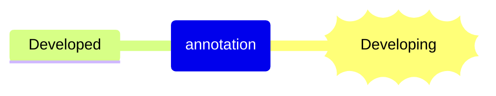
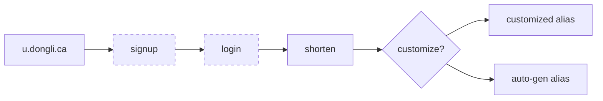
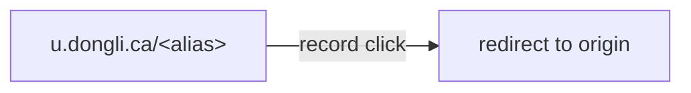

<h1 align="center"> URL Shorten System<h1>

<div align="center">
  
  
  
  
  
</div>

## Overview

This project aim to practice courses Software System Design and Web Application Development altogether.

The developing version has been deployed on <https://u.dongli.ca>, please expect  occasional instability.

## Current File Structure

```
└── .
    └── 📁client
        └── 📁src
            └── App.css
            └── App.jsx
            └── main.jsx
            └── index.css
            └── 📁assets
            └── 📁components
            └── 📁config
            └── 📁contexts
            └── 📁layout
            └── 📁pages
            └── 📁services
            └── 📁utils
        └── .env
        └── .eslintrc.cjs
        └── index.html
        └── package.json
        └── postcss.config.js
        └── tailwind.config.js
        └── vite.config.js
    └── 📁server
        └── 📁config
        └── 📁controllers
        └── 📁models
        └── 📁routes
        └── 📁services
        └── server.js
        └── package-lock.json
        └── package.json
    └── .env
    └── .gitignore
    └── LICENSE
    └── package.json
    └── README.md
```

## Web Pages

| Page | Process |
|:-----|:-------|
| Home/Shorten |  |
| LogIn |  |
| SignUp |  |
| /\<alias\> |  |
| aliasnotfound |  |
| forgot password |  |
| MyURL/dashboard |  |
| Profile |  |
| About |  |

## Function Map





## Usage

### Generate Short URL



### Redirect Short URL



### Analyze Clicks

==🚧===🚧==
